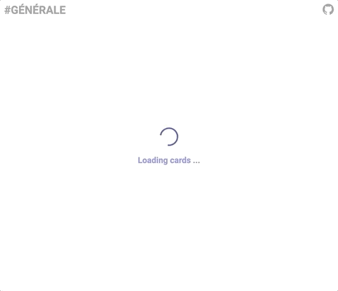
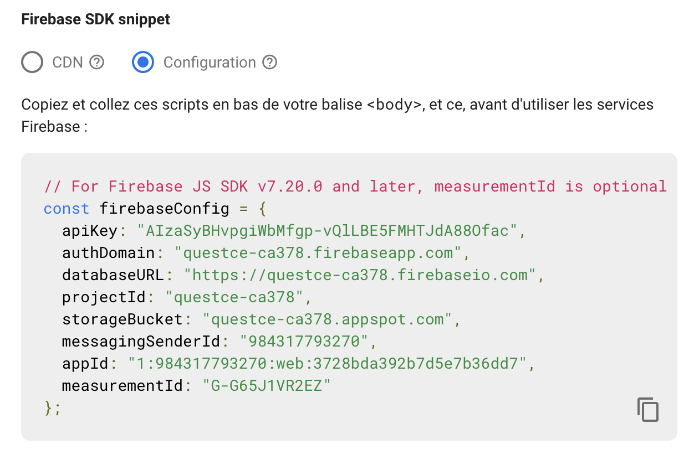
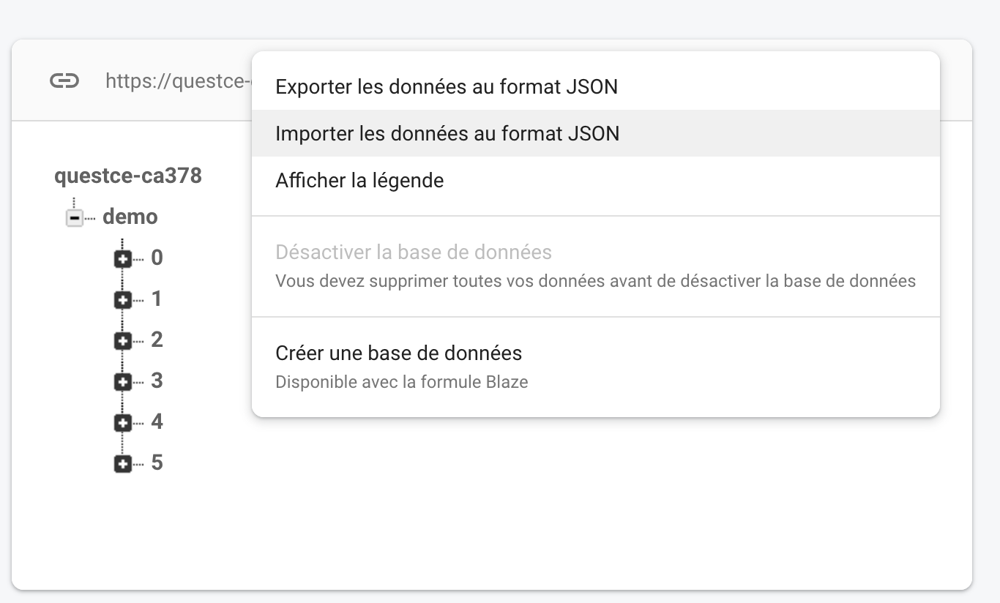

#  QuEstCe le Quizz

> Quickly generate memory flashcards to better learn and review knowledge.

 

## 📚 Table of Contents

- [Test It Now](#test-it-now)
- [Installation](#installation)
- [Customize](#customize)
- [Database structure](#database-structure)
- [Contributing](#contributing)
- [License](#license)

---

## 📢 Test It Now

1.  Go to the [demo here](https://quiz.lucas-marandat.fr/?id=demo).
2.  Then enjoy !

## 🚀 Installation

1. Fork the project
2. Clone it
3. Install dependencies `npm install`
4. Start the project `npm start`

## 🎨 Customize

### 1️⃣ Create a firebase project

Create a firebase project with a **web application** and a **realtime database** (if you don't how follow [the official steps](firebase.google.com))

### 2️⃣ Link the local firebase config to your firebase app

On the **setting** of your firebase **web application** copy and past your **firebase config** into [static/config.js](./static/config.js) file



### 3️⃣ Create your content

**Edit** the [static/database.json](./static/database.json) file and respect the data structure explained bellow

### 4️⃣ Upload your database

**Upload** your data to your **realtime database**



### 5️⃣ The enjoy !

- Run `npm start`
- Go to [http://localhost:3000/?id=demo](http://localhost:3000/?id=demo) (`id=...` refers to the name of the key you've given to your topic in [static/database.json](./static/database.json), note that if you don't provide any id all topics will be fetched)

```bash
git clone https://github.com/lucasmrdt/edt-to-google-calendar
cd edt-to-google-calendar
pip install -r requirements.txt --user
```

## 🏗 Database structure

> See [static/database.json](./static/database.json)

|             key             |         type          |
| :-------------------------: | :-------------------: |
| topic name _(eg. `"demo"`)_ | List<[ICard](#icard)> |

### ICard

|      key      | required |   type   |     example     |                                             description                                              |
| :-----------: | :------: | :------: | :-------------: | :--------------------------------------------------------------------------------------------------: |
|   question    |    ✅    | `string` | `"my question"` | Enter your question here, past some url picture to embed a picture and write latex with `$x = \\pi$` |
|    answer     |    ✅    | `string` |  `"my answer"`  |  Enter your answer here, past some url picture to embed a picture and write latex with `$x = \\pi$`  |
| un_reversible |    ❌    |  `bool`  |     `false`     |                         Set to `true` if your question is a one way question                         |

---

## 💌 Contributing

Fell free to enhance the project by adding some new / more customable features.

## ☎️ Support

Reach out to me at one of the following places!

- Website at <a href="https://lucas-marandat.fr" target="_blank">`lucas-marandat.fr`</a>
- LinkedIn at <a href="https://www.linkedin.com/in/lucasmrdt/" target="_blank">`@lucasmrdt`</a>

## 📝 License

[](http://badges.mit-license.org)

- **[MIT license](http://opensource.org/licenses/mit-license.php)**
